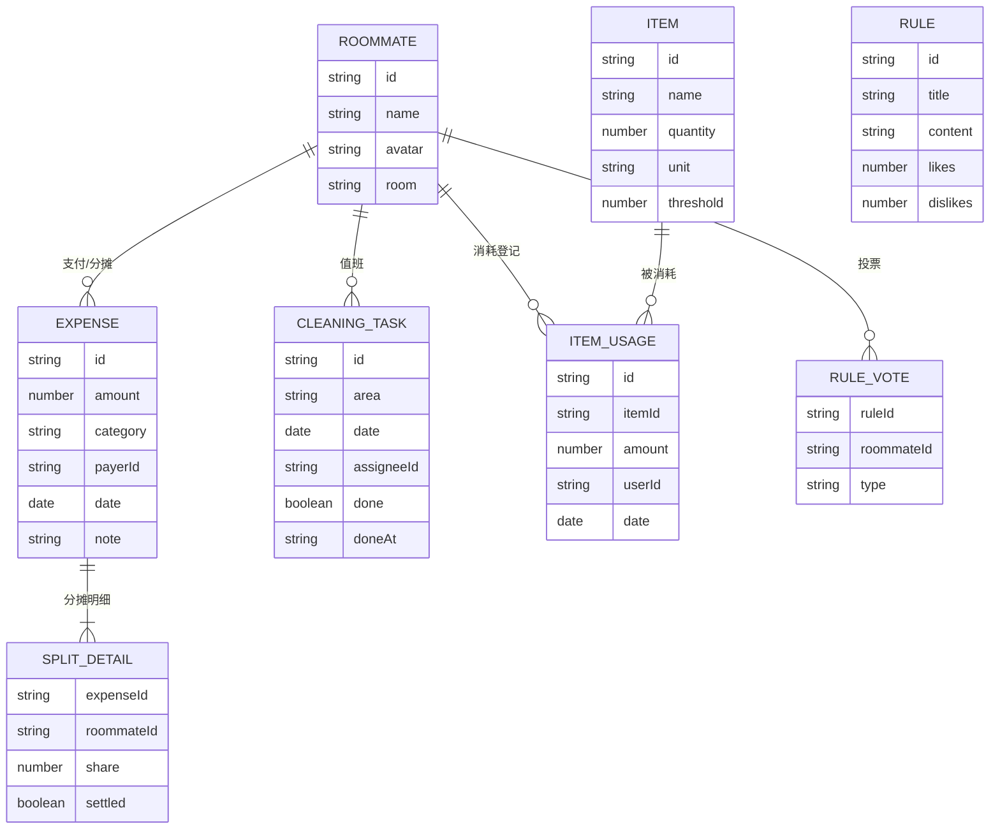

## 1. 架构设计

纯前端单页应用，数据持久化使用 localStorage，无需后端服务，便于部署与长期维护。

```mermaid
flowchart TD
    subgraph "前端层"
        "React SPA" --> "页面路由"
        "页面路由" --> "首页/费用/值日/物品/公约"
    end
    subgraph "数据层"
        "localStorage 持久化" --> "费用数据"
        "localStorage 持久化" --> "值日数据"
        "localStorage 持久化" --> "物品数据"
        "localStorage 持久化" --> "公约数据"
        "localStorage 持久化" --> "室友数据"
    end
    "首页/费用/值日/物品/公约" --> "自定义 Hook 读写数据层"
    "自定义 Hook 读写数据层" --> "localStorage 持久化"
```

## 2. 技术说明
- 前端：React@18 + tailwindcss@3 + vite
- 初始化工具：vite-init
- 路由：react-router-dom@6
- 动画：framer-motion
- 图标：lucide-react
- 后端：无（纯前端应用）
- 数据库：无（使用 localStorage 本地持久化，预置演示数据）

## 3. 路由定义
| 路由 | 用途 |
|------|------|
| / | 首页 Dashboard |
| /expenses | 费用分摊页 |
| /cleaning | 清洁排班页 |
| /items | 公共物品页 |
| /rules | 室友公约页 |

## 4. 数据模型

### 4.1 数据模型定义


### 4.2 数据存储结构
localStorage 以 `home_help_*` 为 key 前缀存储各实体 JSON 数组，应用启动时检测并初始化预置演示数据。

## 5. 部署说明
- 构建产物为静态文件，部署至静态托管平台（如 Vercel / Netlify / GitHub Pages）
- 构建命令：`npm run build`
- 产物目录：`dist`
- 无环境变量依赖
